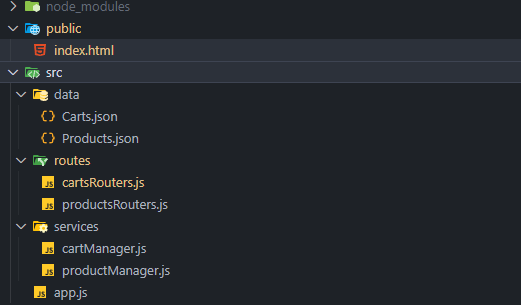

<h1>Primera preEntrega BackEnd CoderHouse 2024</h1>


## por Carlos Kaar


## El proyecto consiste en el desarrollo de un eCommerce con su sistema CRUD desde el BackEnd, siendo el entorno de desarrollo Node JS.

### Las dependencias que estamos utilizando son :


```javascript
const express = require('express')
const app = express()

app.get('/', function (req, res) {
  res.send('Hello World')
})

app.listen(3000)
```
## Express JS
### ¿Qué es ExpressJS?
### Express es un marco de aplicación web de nodo js que proporciona amplias ### funciones para crear aplicaciones web y móviles. Se utiliza para crear ### una aplicación web híbrida, de una sola página o de varias páginas.

### Es una capa construida en la parte superior de Node js que ayuda a administrar servidores y rutas.

### ¿Por qué expresar JS?
### Express fue creado para crear API y aplicaciones web con facilidad.
### Ahorra mucho tiempo de codificación casi a la mitad y aún hace que la web y las aplicaciones móviles son eficientes.
### Otra razón para usar express es que está escrito en javascript.

## Routes.js

### Routes permite realizar envíos fácilmente en función de cadenas de estilo URL. Viene con una función de enrutador predeterminada que puede usar para enrutar solicitudes http, pero también expone claramente la funcionalidad importante para que también pueda usarla para realizar coincidencias de patrones de cadenas más genéricas.

```javascript
import productsRouter from "./routes/productsRouters.js";
import cartsRouter from "./routes/cartsRouters.js";
```




## Class 

```javascript
import fs from "fs/promises";
import path from "path";

export class CartManager {
  constructor(
    filePathCart = path.resolve("./src/data/Carts.json"),
    filePathProd = path.resolve("./src/data/Products.json")
  ) {
    this.carts = [];
    this.pathCart = filePathCart;
    this.pathProd = filePathProd;
  }
  ```

  ### Las clases de javascript, introducidas en ECMAScript 2015, son una mejora sintáctica sobre la herencia basada en prototipos de JavaScript. La sintaxis de las clases no introduce un nuevo modelo de herencia orientada a objetos en JavaScript. Las clases de JavaScript proveen una sintaxis mucho más clara y simple para crear objetos y lidiar con la herencia.

  ### Con el uso de las clases CartManager y ProductManager he realizado el CRUD de los productos, y la interacción entre el usuario y el producto para poder cargarlo en el carrito, cada carrito cuenta con su ID propia lo que permite poder identificar a que cliente pertenece y brindar un carrito por usuario.

  ```javascript
  cartsRouter.post("/api/carts/:cid/products/:pid", async (req, res) => {
  const cartId = parseInt(req.params.cid);
  const prodId = parseInt(req.params.pid);

  try {
    const checkId = await cartsManager.checkProductId(prodId);
    const checkIdCart = await cartsManager.checkCartId(cartId);

    console.log(checkId);

    if (!checkId) {
      return res
        .status(400)
        .json(`Debe seleccionar un id de producto existente`);
    }
    if (!checkIdCart) {
      return res
        .status(400)
        .json(`Debe seleccionar un id de un carrito existente`);
    }
    const addToCart = cartsManager.addProductToCart(cartId, prodId);

    res.status(201).json({
      message: `Agregado producto id: ${prodId} al carrito id: ${cartId}`,
    });
  } catch (error) {
    res.status(500).json(`Error al obtener cargar producto en carrito`, error);
  }
  ```
  ## Multer 
  

  ### Multer es un middleware de node.js para manejar multipart/form-data, que se utiliza principalmente para cargar archivos. 

  El proyecto actualmente esta en desarrollo.

 ### Gracias por tu tiempo!

